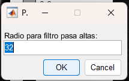
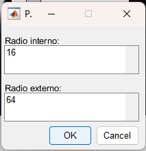
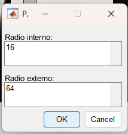
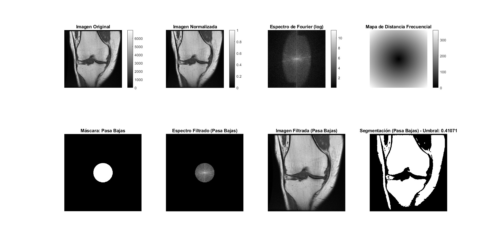
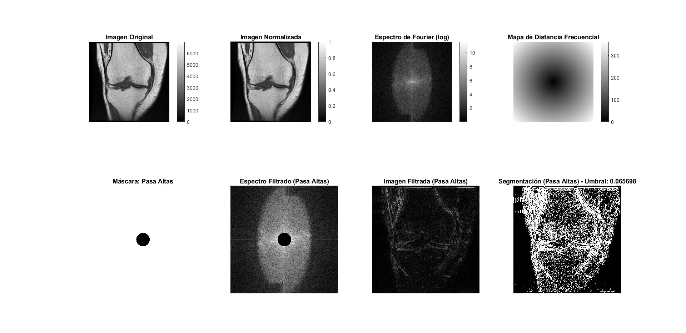
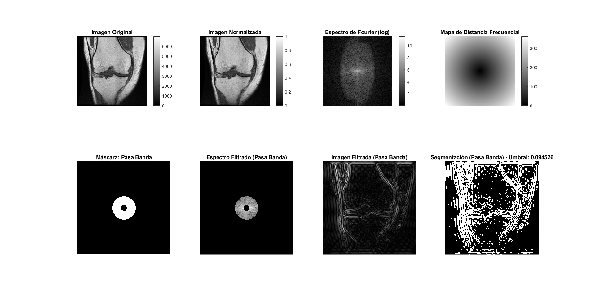
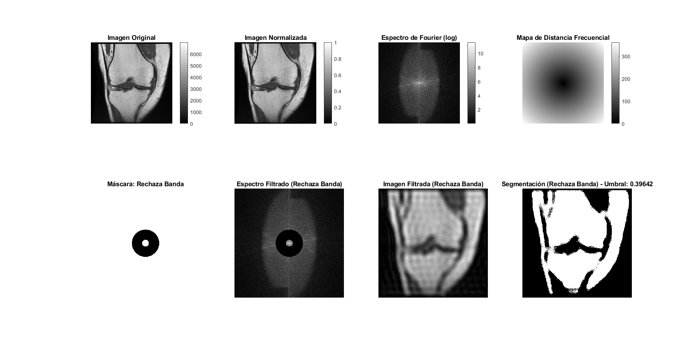

# Procesamiento de Imágenes Médicas mediante Filtrado Frecuencial 🏥💻

## Descripción General 📄
Este proyecto implementa un sistema de procesamiento de imágenes médicas en MATLAB que utiliza la **Transformada de Fourier** para analizar y filtrar imágenes en el dominio de la frecuencia. Posteriormente, aplica técnicas de segmentación para resaltar regiones de interés en imágenes DICOM, específicamente resonancias magnéticas de rodilla.

## Características Clave ✨
- 🖼️ Carga y visualización de imágenes DICOM médicas
- 🌈 Normalización y transformación al dominio frecuencial
- 🔧 Cuatro tipos de filtros frecuenciales configurables
- ⚙️ Interfaz gráfica interactiva con menús contextuales
- 🔍 Segmentación automática mediante umbralización adaptativa
- 📊 Visualización comparativa de resultados intermedios y finales

## ¿Cómo Funciona? ⚙️
El sistema sigue un flujo de procesamiento estructurado:

1. **Carga de imagen DICOM**: Lectura de metadatos y píxeles
2. **Preprocesamiento**: Normalización a rango [0,1]
3. **Transformada de Fourier**: Conversión al dominio frecuencial
4. **Selección de filtro**: Interfaz interactiva para elegir tipo de filtro
5. **Configuración de parámetros**: Radio(s) de corte frecuencial
6. **Aplicación de filtro**: Multiplicación en dominio frecuencial
7. **Transformada inversa**: Reconstrucción de imagen espacial
8. **Segmentación**: Umbralización automática basada en intensidad media

  
*Interfaz principal de selección de filtros*

### Submenús de Configuración
| Tipo de Filtro | Subventana de Parámetros |
|----------------|--------------------------|
| **Pasa Bajas** |  |
| **Pasa Altas** |  |
| **Pasa Banda** |  |
| **Rechaza Banda** |  |

## Propósito 🎯
Este sistema tiene como finalidad:
- 🔬 Facilitar el análisis de imágenes médicas mediante técnicas de procesamiento de señales
- 🦴 Resaltar características anatómicas de interés en estudios de resonancia magnética
- 🧠 Servir como herramienta educativa para estudiantes de ingeniería biomédica
- 💡 Demostrar aplicaciones prácticas de la Transformada de Fourier en imagenología

## Resultados 📊

### Filtro Pasa Bajas
  
*Efecto de suavizado al eliminar altas frecuencias (ruido y detalles finos)*

### Filtro Pasa Altas
  
*Realce de bordes y estructuras anatómicas al eliminar bajas frecuencias*

### Filtro Pasa Banda
  
*Aislamiento de frecuencias específicas para resaltar tejidos intermedios*

### Filtro Rechaza Banda
  
*Eliminación selectiva de bandas frecuenciales para suprimir artefactos*

## Aplicaciones Futuras 🚀
1. **Diagnóstico asistido**: Integración con sistemas CADx para detección temprana de patologías
2. **Biomecánica**: Análisis cuantitativo de tejidos en estudios de movimiento
3. **Telemedicina**: Procesamiento remoto de estudios de imagenología
4. **Investigación**: Plataforma para probar nuevos algoritmos de filtrado médico
5. **Educación**: Simulador interactivo para cursos de procesamiento de imágenes médicas

## 📜 Licencia
Copyright © 2025 Jesús Vásquez - Tecnológico de Monterrey

Este proyecto es material académico desarrollado como parte del programa educativo 
del Tecnológico de Monterrey. Se permite su uso para fines educativos y de investigación, siempre que se cite 
adecuadamente la fuente académica y se respeten los derechos de autor de las 
imágenes utilizadas en el proyecto.

---

**🔧 Requisitos**: MATLAB R2024b o superior  
**👨‍💻 Autor**: Jesús Vásquez
**🏫 Institución**: Tecnológico de Monterrey  
